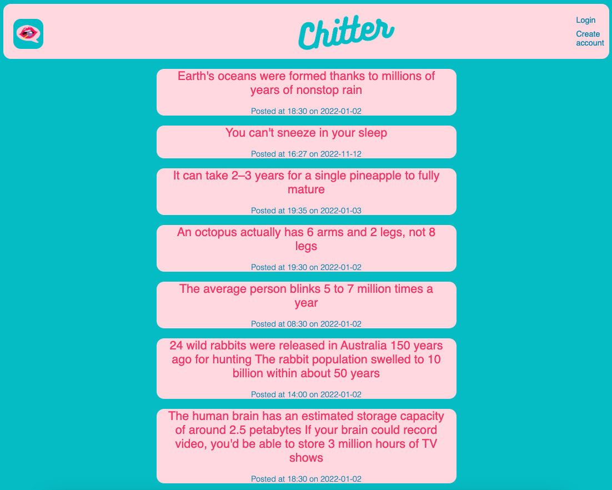
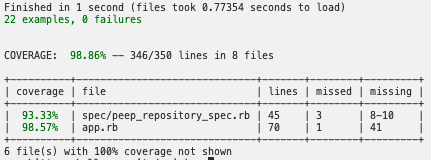

# Chitter Challenge
=================

A small Twitter clone that will allow the users to post messages to a public stream.



# How To Install

- Create a clone of this repo

- Create 2 databases using PostgreSQL
  - ````chitter_challenge````
  - ````chitter_challenge_test````

- Set up tables
````psql -h 127.0.0.1 chitter_challenge < users.sql````
````psql -h 127.0.0.1 chitter_challenge < peeps.sql````
````psql -h 127.0.0.1 chitter_challenge_test < users.sql````
````psql -h 127.0.0.1 chitter_challenge_test < peeps.sql````

- Seed tables
````psql -h 127.0.0.1 chitter_challenge < seeds.sql````
````psql -h 127.0.0.1 chitter_challenge_test < seeds.sql````

- Install dependencies:
````
bundle install
````

- Run tests
```
rspec
```


- To view in browser 
````
rackup
````

- Navigate to http://localhost:9292/

## Tech Stack:
- Ruby
- Sinatra
- PostgreSQL
- HTML
- CSS
- RSpec

# User Stories:
-------

```
STRAIGHT UP

As a Maker
So that I can let people know what I am doing  
I want to post a message (peep) to chitter

As a maker
So that I can see what others are saying  
I want to see all peeps in reverse chronological order

As a Maker
So that I can better appreciate the context of a peep
I want to see the time at which it was made

As a Maker
So that I can post messages on Chitter as me
I want to sign up for Chitter

HARDER

As a Maker
So that only I can post messages on Chitter as me
I want to log in to Chitter

As a Maker
So that I can avoid others posting messages on Chitter as me
I want to log out of Chitter

ADVANCED

As a Maker
So that I can stay constantly tapped in to the shouty box of Chitter
I want to receive an email if I am tagged in a Peep
```